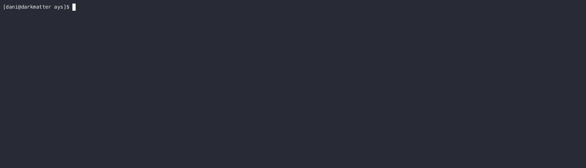

# AYS - Are You Sure?

## About AYS

`ays` (Are You Sure?) is small command line application that asks the user for confirmation before piping
its `stdin` into its `stdout`. If the user does not successfully confirm, `ays` writes `EOF` to its `stdout`.

`ays` is a great utility when defining shell aliases that you'd like to have a user confirmation before proceeding:



I've personally found that `ays` is a great companion for `fzf`, but I'm pretty sure people will find other really
interesting use cases. See some of my personal use cases down below.

## Install

```
cargo install ays
```

## Usage

```
ays ["alternative prompt"]
```

If you'd like `ays` to use a different prompt message than the default "Are you sure?", you can specify it as its
parameter (`ays` will append the closing question mark itself).

## Examples

### Deleting git branches locally checked out

```
alias gbd="git for-each-ref --format='%(refname:short)' refs/heads/ | fzf --height=~20 | ays | xargs git branch -D"
```
